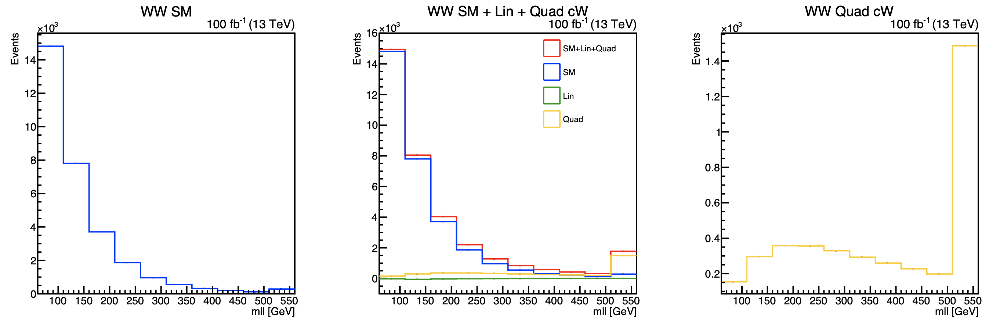
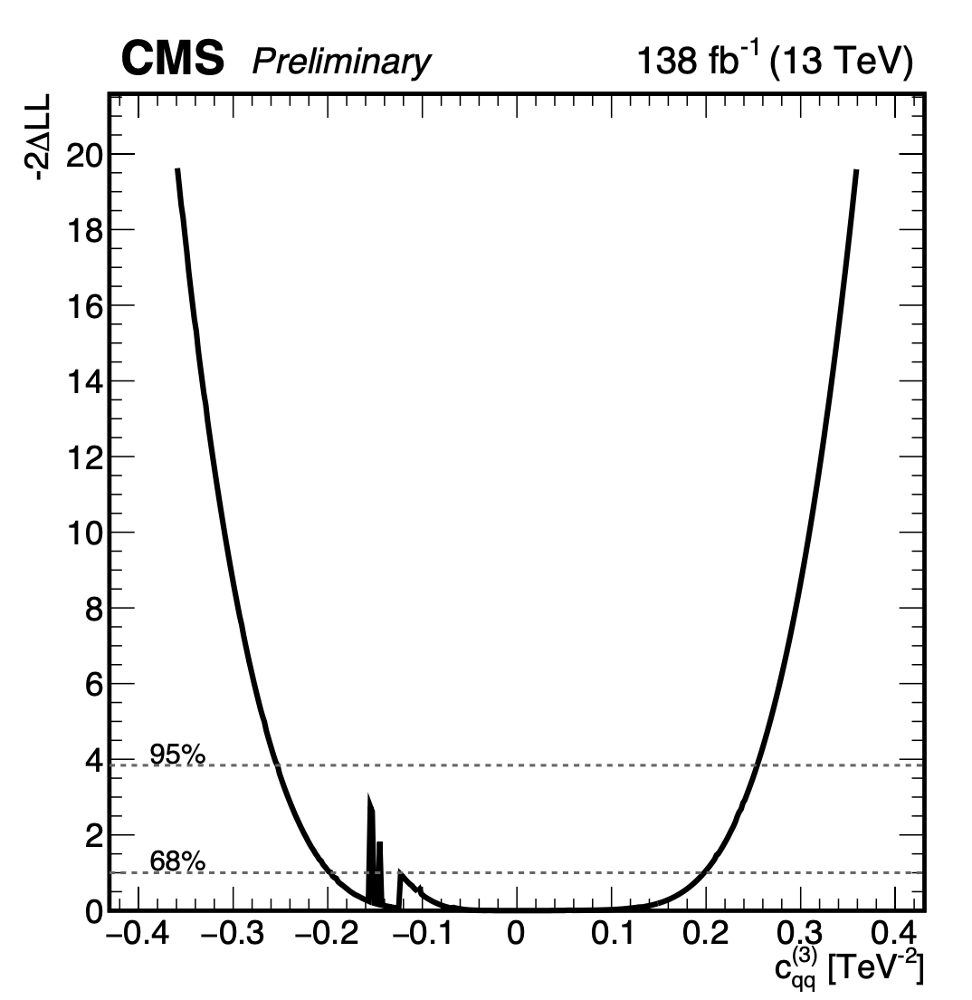
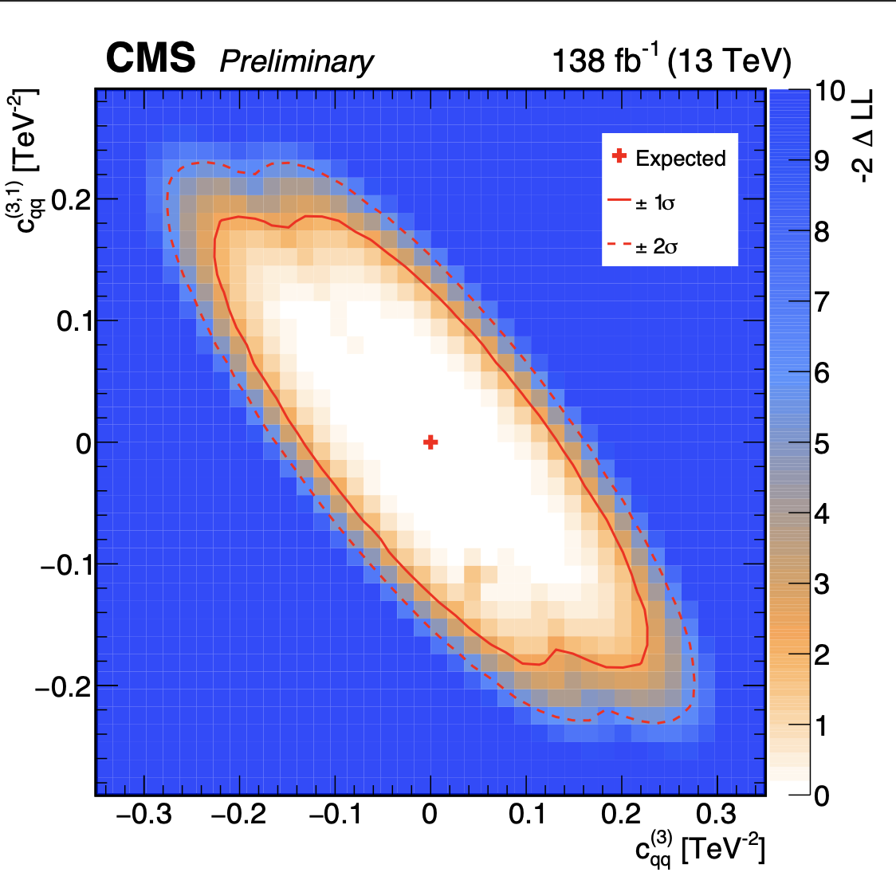

# Branches guidelines

The AAC suite provides different Combine PhysicsModels compatible with different releases of Combine itself:

- `el9-cmssw` (recommended): el9 compatible with Combine v10 and CMSSW_14_1_0_pre4
- `template_morphing`: el9 compatible with Combine v10 and CMSSW_14_1_0_pre4. Same as `el9-cmssw` with an additional model (`AnomalousCouplingMorphing.py`) to account for correlated MC stat uncertainties on EFT predictions. To be used ***ONLY*** with a [modified Combine version](https://github.com/GiacomoBoldrini/HiggsAnalysis-CombinedLimit/tree/correlated_autoMCstat)
- `master`: slc7 compatible with Combine v8 and CMSSW_10_2_X. Deprecated

Before running the tool, be sure to git checkout to the correct AnalyticAnomalousCoupling branch compatible with the CMSSW and Combine version used.

# AnalyticAnomalousCoupling

The AnalyticAnomalousCoupling provides a ***Combine-based model for EFT fits*** overcoming the issues of negative templates that may arise from interference terms.

Suppose to expand the SM Lagrangian with the inclusion of a dimension 6 operator ( $Q_{\alpha}$ ):

$$ \mathcal{L}\_{SMEFT} = \mathcal{L}\_{SM} + \frac{c\_{\alpha}}{\Lambda^{2}} Q\_{\alpha} $$

Then the scattering amplitude would be written as

$$ \mathcal{A}\_{SMEFT} = \mathcal{A}\_{SM} + \frac{c\_{\alpha}}{\Lambda^{2}} \mathcal{A}\_{Q\_{\alpha}}  $$

Where $\mathcal{A}\_{SM}$ is the Standard Model Amplitude and $\mathcal{A}\_{\alpha}$ is the total amplitude obtained with the insertion of the operatoer $Q\_{\alpha}$ 

As a consequence, the expected number of events in a given phase-space region scales with the Wilson coefficient $c\_{\alpha}$ as:

$$ N \propto |\mathcal{A}\_{SMEFT}|^{2} = |\mathcal{A}\_{SM}|^2 + \frac{c\_\alpha}{\Lambda^2} \cdot 2\Re(\mathcal{A}\_{SM}\mathcal{A}\_{Q\_\alpha}^{\dagger})
    +   
 \frac{c\_{\alpha}^{2}}{\Lambda^4}  \cdot |\mathcal{A}\_{Q\_{\alpha}}|^2 $$
 
In order to fit the parameter $c\_{\alpha}$ one would need to provide combine with a SM template ($|\mathcal{A}\_{SM}|^2$), a template for the linear-scaling term $2\Re(\mathcal{A}\_{SM}\mathcal{A}\_{Q\_\alpha}^{\dagger})$ and the tempate for the quadratic term $|\mathcal{A}\_{Q\_{\alpha}}|^2$. The problem stands in the linear term that, being an interference between a dimension-6 and SM amplitudes, can be negative and cannot be interpreted as a p.d.f by combine.

This package provides a workaround to this problem by rewriting the formula in terms of positive definite quantities (amplitude squared). For the simple example of the one-operator case the formule reads as:

$$ 
N = (1 − c\_{\alpha}) \cdot |\mathcal{A}\_{SM}|^2 + c\_{\alpha} \cdot (|\mathcal{A}\_{SM}|^2 + 2\Re(\mathcal{A}\_{SM}\mathcal{A}\_{Q\_\alpha}^{\dagger}) + |\mathcal{A}\_{Q\_{\alpha}}|^2) + (c\_{\alpha}^2 − c\_{\alpha}) \cdot |\mathcal{A}\_{Q\_{\alpha}}|^2 $$

By renaming 

**Sm** = $|\mathcal{A}\_{SM}|^2$,

**Lin**$\_\alpha$ = $2\Re(\mathcal{A}\_{SM}\mathcal{A}\_{Q\_\alpha}^{\dagger})$

**Quad**$\_\alpha$ = $|\mathcal{A}\_{Q\_{\alpha}}|^2$

$$ N = (1 − c\_{\alpha}) \cdot \text{Sm} + c\_{\alpha} \cdot (\text{Sm} + \text{Lin}\_\alpha + \text{Quad}\_\alpha) + (c\_{\alpha}^2 − c\_{\alpha}) \cdot \text{Quad}\_\alpha $$

Where the component **Sm** is the Standard Model amplitude squared, **Quad** is the dimmension-6 amplitude squared and **Sm + Lin + Quad** is given by the square of the sum of the SM and dimension-6 amplitudes $|\mathcal{A}\_{SMEFT}|^2 = | \mathcal{A}\_{SM} + \frac{1}{\Lambda^{2}} \mathcal{A}\_{Q\_{\alpha}} |^2$ for $c\_\alpha = 1$. All these terms are positive definite and are allowed to use in combine.

This model generalises the previous strategy to an arbitrary number of operators where the expected nuber of events in a given phase-space can be now written as:

$$ N \propto |\mathcal{A}\_{SMEFT}|^{2} = 
    |\mathcal{A}\_{SM}|^2
    + 
    \sum\_\alpha\frac{c\_\alpha}{\Lambda^2} \cdot 2\Re(\mathcal{A}\_{SM}\mathcal{A}\_{Q\_\alpha}^{\dagger})
    +   
    \sum\_{\alpha,\beta}\frac{c\_\alpha c\_\beta}{\Lambda^4}  \cdot (\mathcal{A}\_{Q\_\alpha}\mathcal{A}\_{Q\_\beta}^\dagger) $$
    
    
And the rewriting in terms of positive defined quantities reads as:

$$N \propto  \text{Sm} \cdot \left( 1 - \sum\_{\alpha} c\_\alpha + \sum\_{\alpha, \alpha < \beta} \sum\_{\beta} c\_\alpha \cdot c\_\beta  \right) +   \sum\_{\alpha} \left[ \left( c\_\alpha - \sum\_{\alpha \neq \beta} c\_\alpha \cdot c\_\beta \right)  \cdot \left(  \text{Sm} + \text{Lin}\_\alpha + \text{Quad}\_\alpha  \right) \right] + \sum\_\alpha \left(c\_\alpha ^2 - c\_\alpha \right) \cdot \text{Quad}\_\alpha + $$

$$ + \sum\_{\alpha, \alpha<\beta}\sum\_{\beta} c\_\alpha \cdot c\_\beta \cdot \left[ \text{Sm} + \text{Lin}\_\alpha + \text{Quad}\_\alpha + \text{Lin}\_\beta + \text{Quad}\_\beta + 2\cdot \text{Mix}\_{\alpha,\beta} \right] $$

Where 

**Sm** = $|\mathcal{A}\_{SM}|^2$,

**Quad**$\_\alpha$ = $|\mathcal{A}\_{Q\_{\alpha}}|^2$

**Sm + Lin**$\_\alpha$ **+ Quad**$\_\alpha$ = $| \mathcal{A}\_{SM} + \frac{1}{\Lambda^{2}} \mathcal{A}\_{Q\_{\alpha}} |^2$

**Sm + Lin**$\_\alpha$ **+ Quad**$\_\alpha$ **+ Lin**$\_\beta$ **+ Quad**$\_\beta$ **+ 2**$\cdot$ **Mix**$\_{\alpha,\beta}$ = $| \mathcal{A}\_{SM} + \frac{1}{\Lambda^{2}} \mathcal{A}\_{Q\_{\alpha}} + \frac{1}{\Lambda^{2}} \mathcal{A}\_{Q\_{\beta}} |^2$

---- 

# Install:

    cmsrel CMSSW_10_2_13
    cd CMSSW_10_2_13/src
    cmsenv
    git clone https://github.com/cms-analysis/HiggsAnalysis-CombinedLimit.git HiggsAnalysis/CombinedLimit
    cd HiggsAnalysis/CombinedLimit
    git fetch origin
    git checkout v8.2.0
    cd ..
    git clone git@github.com:amassiro/AnalyticAnomalousCoupling.git
    scramv1 b clean; scramv1 b # always make a clean build


    
# Install el9

    cmsrel CMSSW_14_1_0_pre4
    cd CMSSW_14_1_0_pre4/src
    cmsenv
    git clone https://github.com/cms-analysis/HiggsAnalysis-CombinedLimit.git HiggsAnalysis/CombinedLimit
    cd HiggsAnalysis/CombinedLimit
 
    git fetch origin
    git checkout v10.0.1

    cd ..
    git clone git@github.com:amassiro/AnalyticAnomalousCoupling.git
    cd AnalyticAnomalousCoupling; git checkout el9-cmssw; cd -
    scramv1 b clean; scramv1 b # always make a clean build

    
    
# Install: new CMSSW release and new el9 --> use branch el9-cmssw

    cmsrel CMSSW_14_1_0_pre4
    cd CMSSW_14_1_0_pre4/src
    cmsenv
    git clone https://github.com/cms-analysis/HiggsAnalysis-CombinedLimit.git HiggsAnalysis/CombinedLimit
    cd HiggsAnalysis/CombinedLimit
 
    git fetch origin
    git checkout v10.0.1

    cd ..
    git clone git@github.com:amassiro/AnalyticAnomalousCoupling.git
    cd AnalyticAnomalousCoupling; git checkout el9-cmssw; cd -
    scramv1 b clean; scramv1 b # always make a clean build

    
# Model to be used:

    AnomalousCouplingEFTNegative
    

# Providing shapes and building datacards

So you might ask yourself how to build templates and datacards in a way compatible with the combine model.
The model `AnomalousCouplingEFTNegative` accepts the following inputs positively defined:

- SM
- SM + Lin $\_{\alpha}$ + Quad $\_{\alpha}$
- Quad $\_{\alpha}$
- SM + Lin $\_{\alpha}$ + Quad $\_{\alpha}$ + Lin $\_{\beta}$ + Quad $\_{\beta}$ + 2 $\cdot$ Mix $\_{\alpha, \beta}$

In the case of one operator, only the first three templates are expected, otherwise the last component has to be produced for each operator pair ( $\alpha, \beta , \forall \alpha \neq \beta$).

From MC tools one can usually retrieve the single shapes for SM, Lin, Quad components. For more explanation on how to generate these shapes with amplitude decomposition and reweighting methods we refer to the chapter [Generating the shapes](#generating-the-shapes) below in this guide or to the overwhelming literature.

Likely templates for a real-life situation are shown in figure as an example. Note how the linear component is negative and is not allowed in combine

<div href="url">

</div>

The templates for `SM` and `Quad` are already what you need for the `AnomalousCouplingEFTNegative` model. The linear shape should be substituted with `SM+Lin+Quad` simply by summing all the shapes in the previous figure. An example of the result is reported in the following image

<div href="url">

</div>

The datacard that can be built with those shapes reads as:

```
## Shape input card
imax 1 number of channels
jmax * number of background
kmax * number of nuisance parameters
----------------------------------------------------------------------------------------------------
bin         inWW_cW
observation 0
shapes  *           * shapes/histos_inWW_cW.root     histo_$PROCESS histo_$PROCESS_$SYSTEMATIC
shapes  data_obs           * shapes/histos_inWW_cW.root     histo_Data
bin              inWW_cW                       inWW_cW                       inWW_cW                       
process          sm                            sm_lin_quad_cW                quad_cW                            
process          1                             2                             3                             
rate             30611.7690                    34426.6029                    3957.9833               
----------------------------------------------------------------------------------------------------
lumi  lnN        1.02                          1.02                          1.02                          
----------------------------------------------------------------------------------------------------

```
**The datacard name for the processes field should follow a precise convention** in order for the model to build the pdfs correctly. This table summarises a 2 operator case ( $c\_{W}, c\_{HW}$ )

| Template | Datacard Name | Expression combine model |
| -------- | ----------- | ----------- |
| SM | `sm` | `func_sm("@0*(1-(@1+@2-@1*@2))",r,k_cW, k_cHW)` |
| Quad $c\_W$ | `quad_cW` | `func_quadratic_cW("@0*(@1*@1-@1)",r,k_cW)`|
| SM + Lin $c\_W$ + Quad $c\_W$| `sm_lin_quad_cW` | `func_sm_linear_quadratic_cW("@0*(@1 * (1-(@2) ))",r,k_cW, k_cHW)`|
| Quad $c\_{HW}$| `quad_cHW` | `func_quadratic_cHW("@0*(@1*@1-@1)",r,k_cHW)`|
| SM + Lin $c\_{HW}$ + Quad $c\_{HW}$| `quad_cHW` | `func_sm_linear_quadratic_cHW("@0*(@1 * (1-(@2) ))",r,k_cHW, k_cW)`|
| SM + Lin $c\_W$ + Quad $c\_W$ + Lin $c\_{HW}$ + Quad $c\_{HW}$ + 2 $\cdot$ Mix $\_{c\_{W}, c\_{HW}}$| `sm_lin_quad_mixed_cW_cHW` | `func_sm_linear_quadratic_mixed_cW_cHW("@0*@1*@2",r,k_cW,k_cHW)`|


    
    
# How to run it:

    cd test 
    
    text2workspace.py      \
            datacard1opNew.txt   \
            -P HiggsAnalysis.AnalyticAnomalousCoupling.AnomalousCouplingEFTNegative:analiticAnomalousCouplingEFTNegative  \
            -o   model_test.root    --X-allow-no-signal  \
          --PO eftOperators=cG
    
    
    combine -M MultiDimFit model_test.root  --algo=grid --points 2000  -m 125   -t -1     \
        --redefineSignalPOIs k_cG \
        --freezeParameters r  \
        --setParameters r=1    --setParameterRanges k_cG=-10,10     \
        --verbose -1
          
    r99t higgsCombineTest.MultiDimFit.mH125.root  higgsCombineTest.MultiDimFit.mH125.root   draw.cxx\(\"k_cG\"\)
    
    
Remember you need to specify the operators you are considering, because the more operators you want to consider
the more inputs you need to provide in the datacard.

You can also add the dim8 operators by

    --PO  addDim8
    
but you can also just define the new operators by
 
    --PO eftOperators=cS0,cS1,cT0

# Support for EFT2Obs and aTGCRooStat

A model similar to AnomalousCouplingEFTNegative support different kind of EFT inputs: AnaliticAnomalousCouplingEFTNegativeExtended. In particular: [EFT2Obs](https://github.com/ajgilbert/EFT2Obs) EFT analyses use JSON containing the bin-by-bin EFT parametrization from fiducial bins as defined in reco-level datacards. On the other hand, old EFT analyses were based on the [aTGCRooStat] (https://twiki.cern.ch/twiki/bin/viewauth/CMS/ATGCRooStats) framework where the EFT parametrization is stored in root files as histograms (TH*F) or functions (TF).
For the first kind of datacards, the combination works out of the box, one just needs to specify an additional command line argument while running ```text2workspace.py``` so that the model can parse the EFT2Obs json file with the parametrization:
```
text2workspace.py combined.txt -P HiggsAnalysis.AnalyticAnomalousCoupling.AnaliticAnomalousCouplingEFTNegativeExtended:analiticAnomalousCouplingEFTNegativeExtended --X-allow-no-signal -o combined.root --PO eftOperators=cW --X-allow-no-background --PO EFTJsonMap=converted_aTGC_EFT2Obs_Wg_SMEFT_cx_into_cw.json
```

For the second type of analyses, exploiting aTGCRooStat, the problem is more subtle. The main idea is to convert the information inside the root files with the signal parametrization into a json file such as the one from EFT2Obs so that the combine model can readily digest them. The signal parametrization should be provided for each bin of the fitted distribution and each bin should be defined as a different process in the datacard (this should always be the case for aTGCRooStat datacards). The downside of this method is that one needs not only the datacards and the shapes but also the signal parametrization files. A script is provided to convert the parametrization from ROOT files to JSON files: ```convertATGCRooStatToJson.py```.

This script makes some assumptions: You should already have aTGCRooStat datacards and all root files should be available, those containing the EFT parametrization as TF(1,2,3) and those of the backgrounds. This scripts reads the parametrization files and converts it into a json file that can be read by AnalyticAnomalousCoupling EFT model.

The EFT parametrization file names should follow this convention:
```
<whatever>_<name>.root
```
Where ```<name>``` is the one appearing in the datacard except for an arbitrary prefix that can be added 
to all samples by specifying the c.l.a. -pp (or --processprefix) so that the datacard name reads as
```
<processprefix>_<name>
```

The parametrization should be know and should be the same for all the root input files. For example 
the files could contain a TF3 function with following content:
```
[0]+[1]*x+[2]*y+[3]*z+[4]*x*y+[5]*x*z+[6]*y*z+[7]*x*x+[8]*y*y+[9]*z*z
```

We do not know what the `x` coeff., namely `[1]`, stands for so it should be provided as an input to this script.
For example, we have multiple files containing the parametrization for each bin as:
```
signal_proc_ZVBF_ptZ_mu_3D_binx0.root, signal_proc_ZVBF_ptZ_mu_3D_binx1.root
signal_proc_ZVBF_ptZ_mu_3D_binx2.root, signal_proc_ZVBF_ptZ_mu_3D_binx3.root, ...
```

And ```atGCRooStat``` compliant datacards with process names:
```
anoCoupl_process_ZVBF_ptZ_mu_3D_binx0, anoCoupl_process_ZVBF_ptZ_mu_3D_binx1
anoCoupl_process_ZVBF_ptZ_mu_3D_binx2, anoCoupl_process_ZVBF_ptZ_mu_3D_binx3, ...
```

The EFT parametrization in the ```signal_proc_*``` files reads as (from a priori knowledge from analysts that developed the parametrization):
```
sm + x*lin_cx + y*lin_cw + z*lin_cb + x*y*mix_cx_cw + x*z*mix_cx_cb + y*z*mix_cw_cb + 
+ x*x*quad_cx + y*y*quad_cw + z*z*quad_cb
```

Therefore this script can be called as:
```
python convertATGCRooStatToJson.py -fg signal_proc_*.root -pp anoCoupl_process -fp signal_proc
                        -c sm:0,lin_cx:1,lin_cw:2,lin_cb:3,mix_cx_cw:4,mix_cx_cb:5,mix_cw_cb:6,quad_cx:7,quad_cw:8,quad_cb:9
                        -mp 8 -o converted_aTGC_EFT2Obs.json
```

Both of the methods have been cross-checked with two analysis examples: [SMP-20-005](https://cms.cern.ch/iCMS/analysisadmin/cadilines?line=SMP-20-005&tp=an&id=2329&ancode=SMP-20-005) for the EFT2Obs part and [SMP-16-018](https://cms.cern.ch/iCMS/analysisadmin/cadilines?line=SMP-16-018&tp=an&id=1838&ancode=SMP-16-018) for the ```aTGCRooStat```. A perfect agreement is found on the likelihood profiles therefore fully validating the method. The datacards for both analyses can respectively be found [here-SMP-20-005](https://gitlab.cern.ch/cms-analysis/smp/SMP-20-005/datacards) and [here SMP-16-018](https://gitlab.cern.ch/cms-eft/thestand).

Datacard combination works out of the box by specifying more than one json file in the ```--PO EFTJsonMap``` separated by a comma, for example:
```
text2workspace.py combined.txt -P HiggsAnalysis.AnalyticAnomalousCoupling2.AnaliticAnomalousCouplingEFTNegativeExtended:analiticAnomalousCouplingEFTNegativeExtended --X-allow-no-signal -o combined.root --PO eftOperators=cW --X-allow-no-background --PO EFTJsonMap=thestand/VBFdatacards/converted_aTGC_EFT2Obs_VBFZ_SMEFT_cx_into_cw.json,SMP-20-005/puppi_phi_f_binned_AAC/converted_aTGC_EFT2Obs_VBFZ_SMEFT_cx_into_cw.json
```
# Plotting Tools

This frameworks comes with plotting tools to support analyst with fast instruments to draw results of fits. For obvious reasons plots are available for 1D and 2D scans on the parameters of interests.

For plots of likelihood profiles `scripts/mkEFTScan.py` supports both:

```
mkEFTScan.py oned.root -p k_cqq3 -maxNLL 10 -lumi 138 -cms -preliminary -xlabel "c_{qq}^{(3)} [TeV^{-2}]"
mkEFTScan.py twod.root -p k_cqq3 k_cqq31 -maxNLL 10 -lumi 138 -cms -preliminary -xlabel "c_{qq}^{(3)} [TeV^{-2}]" -ylabel "c_{qq}^{(3,1)} [TeV^{-2}]"
```

<div href="url">


</div>


For profiled fits one usually scans one/two parameter of interest while leaving the others floating and free to maximse the likelihood at a specific POI. A debugging plotting tool can be useful to print the template (full BSM or single templates) at the fixed POI values on the scan. For plotting options can be concatenated to create a gif: `scan` will just draw the scan as a gif, `overall` will read the datacard and retrieve all templates for SM background and BSM EFT (as many operators as you want) and display the stacked distribution (this function also provides support for rateParameters). `signal` does the same without but backgrounds (only `sm` template from datacard). Lastly `templates` method will draw `signal` plus all the single templates that scale as a function of the various parameters.
The process is repeated for all regions of the datacards.

An example is provided in the following gif:
```
mkEFTGifs.py -d datacard.txt -s higgsCombineTest.MultiDimFit.mH125.root -op k_cqq3 -rp top:CMS_hww_Topnorm2j WW:CMS_hww_WWnorm2j DY_hardJets:CMS_hww_DYnorm2j_hardJets DY_PUJets:CMS_hww_DYnorm2j_PUJets_2016 --frequency 2 -t scan overall signal templates --variables ewkz_2016_zjj_specified:"m_{jj} [GeV]" ewkz_2016_dycr:"m_{jj} [GeV]" --logy -drawSigma -lumi 138
```


# Negative bin yield    


It may happen that the expected yield (SM+EFT) in a bin evaluates negative. Combine will complain and return the maximum FCN value up to that point in the minimization to force MIGRAD to back out of the region. If one want to disable such behaviour and ignore the negative bin (setting its content to zero) add to the combine command the following run-time arguments

   `--X-rtd SIMNLL_NO_LEE --X-rtd NO_ADDNLL_FASTEXIT`


The partial sums will be set to one (so log is zero) and no error will be propagated to RooFit: 

https://github.com/cms-analysis/HiggsAnalysis-CombinedLimit/blob/7bffa8b8758a5dc6824b8b93c098ce9afb1c32a4/src/CachingNLL.cc#L691

https://github.com/cms-analysis/HiggsAnalysis-CombinedLimit/blob/7bffa8b8758a5dc6824b8b93c098ce9afb1c32a4/src/CachingNLL.cc#L692

    
    
# Generating the shapes

The templates needed can be generated in two complementary ways either by *amplitude decomposition* or with *reweighting*. 

With amplitude decomposition the single components (SM, Lin $\_{\alpha}$, Quad $\_{\alpha}$, Mix $\_{\alpha, \beta}$) can be generated. For example exploiting [MadGraph](http://madgraph.phys.ucl.ac.be/) and [SMEFTsim](https://smeftsim.github.io/) one can do as follows:

**SM**:
```
import model SMEFTsim_U35_MwScheme_UFO-SMlimit_massless
generate p p > e+ ve mu- vm~
output WW_SM
```

**Lin**:
```
import model SMEFTsim_U35_MwScheme_UFO-cW_massless
generate p p > e+ ve mu- vm~ NP=1 NP^2==1
output WW_LI
```

**Quad**:
```
import model SMEFTsim_U35_MwScheme_UFO-cW_massless
generate p p > e+ ve mu- vm~ NP=1 NP^2==2
output WW_QU
```

**Mix**:
```
import model SMEFTsim_U35_MwScheme_UFO-cW_cHW_massless
generate p p > e+ ve mu- vm~ NP=1 NP^2==1
output WW_Mix
```

With the reweighting method one can generatefrom the full Lagrangian + one operator and extract the components thanks to a reweighting procedure.
Suppose we start our generation by including all terms, setting the coupling of $c\_{W}=1$

**SM+Lin+Quad**:
```
import model SMEFTsim_U35_MwScheme_UFO-cW_massless
generate p p > e+ ve mu- vm~ NP=1
output WW_Reweight
```

We can now change at reweighting the coupling in order to generate different components

**SM**:

```
change helicity False
change rwgt_dir rwgt

# SM: rwgt_1
launch
   set SMEFT 2 0
```
**SM-Lin+Quad**:

```
# SM - Lin + Quad: rwgt_2
launch
   set SMEFT 2 -1
```

Each event will now have two new reweighting - weights corresponding to the hypothesis $c\_W = 0$ ( $\omega(k=0)$ ) and $c\_W = -1$ ( $\omega(k=-1)$ ). The nominal weight corresponds to the hypothesis $c\_W = 1$ ( $\omega(k=1)$ ). 
Event by event we can add these weights to obtain the Sm / Quadratic / Linear components:

$$ 
\begin{equation}
\begin{cases}
\omega\_{\text{Quad}} = 0.5 \cdot \left [ \omega(k=1) + \omega(k=-1) - 2 \cdot \omega(k=0) \right ] \\
\omega\_{\text{SM}} = \omega(k=0)\\
\omega\_{\text{Lin}} = 0.5 \cdot \left [ \omega(k=1) - \omega(k=-1) \right ]\\
\end{cases}
\end{equation}
$$

For more operators one can generate the components for a single operator by setting all the others at 0 and scanning the values -1,0,1 as described above. For the mixed term instead one should also generate the weight:

```
# SM + Lin + Quad + Lin + Quad + Mix: rwgt_3
launch
   set SMEFT 2 1
   set SMEFT 7 1
```

And the algebra on the weights reads as follows 

$$ 
\omega\_{\text{Mix}} = \omega(1,1) + \omega(0,0) - \omega(1,0) - \omega(0,1)
$$

We stress that these weights should be computed on an event-by-event basis.

Older examples
====
    
    
    
    
    
Run:

    get the file:
    wget https://www.dropbox.com/s/37auaiyq4qw4o3j/histo_0p3.root
    
     sm->Integral(-1, sm->GetNbinsX())
     linear->Integral(-1, linear->GetNbinsX())
     quadratic->Integral(-1, quadratic->GetNbinsX())

     histo_sm->Integral(-1, histo_sm->GetNbinsX())
     histo_linear->Integral(-1, histo_linear->GetNbinsX())
     histo_quadratic->Integral(-1, histo_quadratic->GetNbinsX())

     

                                                                 folder                    file.py             object defined in the file.py
    text2workspace.py        datacard.txt -P HiggsAnalysis.AnalyticAnomalousCoupling.AnomalousCoupling:analiticAnomalousCoupling                 --PO=k_my,r  -o      model_test.root   
    
    
            
        
    combine -M MultiDimFit model_test.root  --algo=grid --points 120  -m 125   -t -1 --expectSignal=1     \
        --redefineSignalPOIs k_my --freezeParameters r --setParameters r=1    --setParameterRanges k_my=-20,20     \
        --verbose -1
    
    combine -M MultiDimFit model_test.root  --algo=grid --points 120  -m 125   -t -1 --expectSignal=1     \
        --redefineSignalPOIs k_my --freezeParameters r --setParameters r=1    --setParameterRanges k_my=-20,20   
    

    
    text2workspace.py        datacard2op.txt -P HiggsAnalysis.AnalyticAnomalousCoupling.AnomalousCoupling:analiticAnomalousCoupling   -o  --numOperators=2    model_test.root   
    
    combine -M MultiDimFit model_test.root  --algo=grid --points 120  -m 125   -t -1 --expectSignal=1     \
        --redefineSignalPOIs k_my_1 --freezeParameters r,k_my_2 --setParameters r=1,k_my_1=0,k_my_2=0    --setParameterRanges k_my_1=-20,20     \
        --verbose -1
    
    
    
    
    text2workspace.py        datacard3op.txt -P HiggsAnalysis.AnalyticAnomalousCoupling.AnomalousCouplingEFT:analiticAnomalousCouplingEFT   -o   model_test.root   
    
    combine -M MultiDimFit model_test.root  --algo=grid --points 240  -m 125   -t -1 --expectSignal=1     \
        --redefineSignalPOIs k_cG \
        --freezeParameters r,k_cGtil,k_cH,k_cHB,k_cHBtil,k_cHDD,k_cHG,k_cHGtil,k_cHW,k_cHWB,k_cHWBtil,k_cHWtil,k_cHbox,k_cHd,k_cHe,k_cHl1,k_cHl3,k_cHq1,k_cHq3,k_cHu,k_cHudAbs,k_cHudPh,k_cW,k_cWtil,k_cdBAbs,k_cdBPh,k_cdGAbs,k_cdGPh,k_cdHAbs,k_cdHPh,k_cdWAbs,k_cdWPh,k_cdd,k_cdd1,k_ceBAbs,k_ceBPh,k_ceHAbs,k_ceHPh,k_ceWAbs,k_ceWPh,k_ced,k_cee,k_ceu,k_cld,k_cle,k_cledqAbs,k_cledqPh,k_clequ1Abs,k_clequ1Ph,k_clequ3Abs,k_clequ3Ph,k_cll,k_cll1,k_clq1,k_clq3,k_clu,k_cqd1,k_cqd8,k_cqe,k_cqq1,k_cqq11,k_cqq3,k_cqq31,k_cqu1,k_cqu8,k_cquqd1Abs,k_cquqd1Ph,k_cquqd8Abs,k_cquqd8Ph,k_cuBAbs,k_cuBPh,k_cuGAbs,k_cuGPh,k_cuHAbs,k_cuHPh,k_cuWAbs,k_cuWPh,k_cud1,k_cud8,k_cuu,k_cuu1   \
        --setParameters r=1    --setParameterRanges k_cG=-10,10     \
        --verbose -1
    
    
    combine -M MultiDimFit model_test.root  --algo=grid --points 400  -m 125   -t -1 --expectSignal=1     \
        --redefineSignalPOIs k_cG,k_cGtil \
        --freezeParameters r,k_cH,k_cHB,k_cHBtil,k_cHDD,k_cHG,k_cHGtil,k_cHW,k_cHWB,k_cHWBtil,k_cHWtil,k_cHbox,k_cHd,k_cHe,k_cHl1,k_cHl3,k_cHq1,k_cHq3,k_cHu,k_cHudAbs,k_cHudPh,k_cW,k_cWtil,k_cdBAbs,k_cdBPh,k_cdGAbs,k_cdGPh,k_cdHAbs,k_cdHPh,k_cdWAbs,k_cdWPh,k_cdd,k_cdd1,k_ceBAbs,k_ceBPh,k_ceHAbs,k_ceHPh,k_ceWAbs,k_ceWPh,k_ced,k_cee,k_ceu,k_cld,k_cle,k_cledqAbs,k_cledqPh,k_clequ1Abs,k_clequ1Ph,k_clequ3Abs,k_clequ3Ph,k_cll,k_cll1,k_clq1,k_clq3,k_clu,k_cqd1,k_cqd8,k_cqe,k_cqq1,k_cqq11,k_cqq3,k_cqq31,k_cqu1,k_cqu8,k_cquqd1Abs,k_cquqd1Ph,k_cquqd8Abs,k_cquqd8Ph,k_cuBAbs,k_cuBPh,k_cuGAbs,k_cuGPh,k_cuHAbs,k_cuHPh,k_cuWAbs,k_cuWPh,k_cud1,k_cud8,k_cuu,k_cuu1   \
        --setParameters r=1    --setParameterRanges k_cG=-10,10:k_cGtil=-10,10      
    
    
    ,k_cG,k_cGtil,k_cH,
      
    
    
    
    
    
To simulate "sm" part, k_my == 0 :
    
    --setParameters r=1,k_my=0
    
    combine -M MultiDimFit model_test.root  --algo=grid --points 120  -m 125   -t -1 --expectSignal=1     \
        --redefineSignalPOIs k_my --freezeParameters r --setParameters r=1,k_my=0    --setParameterRanges k_my=-20,20
    

Plot:

    r99t higgsCombineTest.MultiDimFit.mH125.root  higgsCombineTest.MultiDimFit.mH125.root   draw.cxx
    
    r99t higgsCombineTest.MultiDimFit.mH125.root  higgsCombineTest.MultiDimFit.mH125.root   draw.cxx\(\"k_cG\"\)

    r00t  higgsCombineTest.MultiDimFit.mH125.root    draw2D.cxx\(\"cG\",\"Gtil\",\"k_cG\",\"k_cGtil\"\)    
    
    
    
    
    

    
    
